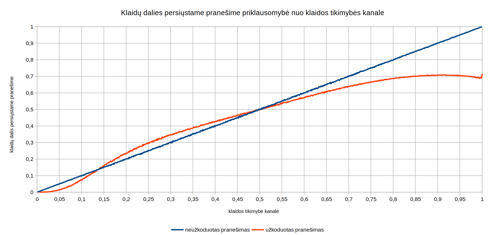

---
numbersections: yes
documentclass: VUMIFPSbakalaurinis
monofont: JetBrains Mono
toc: yes
title-meta: Kodavimo teorijos praktinė užduotis
title: Kodavimo teorijos praktinė užduotis A14
author: Andrius Pukšta
date: Vilnius - 2021
header-includes: |
    \papertype{Kodavimo teorijos praktinės užduoties ataskaita}
    \university{Vilniaus universitetas}
    \faculty{Matematikos ir informatikos fakultetas}
    \authordescription{Programų sistemų 3 kurso studentas}
...

# Realizuotos užduoties dalys

Realizuotos visos užduoties dalys.

Programinės dalys:

- Kodavimas
- Dekodavimas
- Siuntimas kanalu

Scenarijai:

- Bitų vektoriaus siuntimas
- Teksto siuntimas
- Paveiksliuko siuntimas

# Panaudotos trečiųjų šalių bibliotekos

- `opener` - paveiksliukų parodymui
- `rand` - atsitiktinių skaičių generavimui

# Užduoties atlikimo trukmė (apytikslė)


# Programos paleidimas

Programos paleidžiamasis failas yra archyvo pagrindiniame aplanke (ten pat, kur ir šis dokumentas), failas vadinasi `a14.exe`. Programą patogiausia paleisti naudojant `paleisti.bat` failą, esantį tame pačiame aplanke. Jis nustato komandinės eilutės teksto kodavimą į UTF-8 (naudodamas `chcp 65001` komandą), tai leidžia programai ir įvesti, ir išvesti lietuviškus simbolius. Taip pat `paleisti.bat` padaro, kad komandinė eilutė neišsijungtų iškart programai baigus darbą.

# Programos teksto failai

Visas programos kodas yra `src` aplanke:

- `decoding.rs` - realizuotas dekodavimas
- `channel.rs` - realizuotas siuntimas kanalu
- `encoding.rs`- realizuotas užkodavimas
- `converting.rs` - realizuotas konvertavimas tarp įvairių duomenų formatų, naudojamų programoje (žr. [Padaryti programiniai sprendimai](#padaryti-programiniai-sprendimai))
- `main.rs` - realizuoti visi trys naudojimo scenarijai (bitų vektoriaus siuntimas, teksto siuntimas, paveiksliuko siuntimas)
- `experiments.rs` - eksperimentą vykdančios funkcijos

# Vartotojo sąsaja

Paleidus programą visų pirma yra prašoma įvesti kanalo klaidos tikimybę, nes jos reikės visuose trijuose scenarijuose. Klaidos tikimybė yra skačius nuo 0 iki 1 imtinai, dešimtainės trupmenos skirtukas gali būti kablelis arba taškas. Įvedus klaidos tikimybę, naudotojui  liepiama pasirinkti naudojimo scenarijų. Įvedus pasirinkimo numerį, reikia įvesti scenarijui reikalingus duomenis.

Pvz.:  

```
Įveskite klaidos perdavimo kanale tikimybę, priklausančią [0, 1]
(dešimtainės trupmenos skirtukas ',' arba '.'):
0.2
Pasirinkite, ką norite siųsti (įveskite pasirinkimo numerį):
1) Bitų vektorių
2) Tekstą
3) Paveiksliuką
```

## Bitų vektoriaus siuntimas

Norint siųsti bitų vektorių, reikia jį įvesti. Įvedus bitų vektorių, parodomas užkoduotas jo pavidalas (prieš siuntimą), tada iš kanalo išėjęs pranešimas. Toliau nurodomas klaidų, įvykusių kanale, skaičus ir parašomos jų pozicijos (indeksuojant nuo nulio). Tada klaidų pozicijos parodomos iš kanalo išjusiame pranešime, jas pažymint `^`. Tuomet naudotojui leidžiama pasirinkti, ar jis nori pakeisti iš kanalo išėjusį pranešimą. Jeigu naudotojas pasirenka ne, tai jam parodomas dekoduotas pranešimas ir programa baigia darbą. Jeigu naudotojas pasirenka taip, tai programa paprašo įvesti bitų vektorių, kuris bus vėliau dekoduojamas. Šio bitų vektoriaus ilgis privalo sutapti su iš kanalo išėjusio pranešimo ilgiu. Įvedus pakeistą vektorių, programa jį dekoduoja, parodo rezultatą ir baigia darbą.

Pvz.:  

```
Įveskite klaidos perdavimo kanale tikimybę, priklausančią [0, 1]
(dešimtainės trupmenos skirtukas ',' arba '.'):
0,2
Pasirinkite, ką norite siųsti (įveskite pasirinkimo numerį):
1) Bitų vektorių
2) Tekstą
3) Paveiksliuką
1
Įveskite bitų vektorių (sudarytą iš nulių ir vienetų):
10101000011110000101101010
Užkoduotas pranešimas:
1100100010010001011010101001000000110110110111011100000101010100
Iš kanalo išėjęs pranešimas:
1100100011000101001010101011010010100101110111011100000100110101
Klaidų skaičius: 13
Klaidų pozicijos (skaičiuoti pradedama nuo 0):
[9, 11, 13, 17, 26, 29, 32, 35, 38, 39, 57, 58, 63]
Iš kanalo išėjęs vektorius su pažymėtomis klaidų pozicijomis:
1100100011000101001010101011010010100101110111011100000100110101
         ^ ^ ^   ^        ^  ^  ^  ^  ^^                 ^^    ^
Ar norite pakeisti iš kanalo išėjusį pranešimą?
1) taip
2) ne
1
Įveskite iš kanalo išėjusį pranešimą (bitų vektorių). Įvestas vektorius
turi būti tokio pat ilgio kaip ir iš kanalo išėjęs vektorius.
1111100000000000000011111111111111111111100000000000000000000111
Dekoduotas pranešimas:
11110001001101110111100000
```

## Teksto siuntimas

Norint siųsti tekstą, reikia jį įvesti. Kadangi tekstas gali būti keliose eilutėse, programai reikia kaip nors sužinoti, kada jis pasibaigia. Todėl teksto paskutinė eilutė visada turi būti tuščia (t. y. įvedus visą tekstą reikia spasti Enter du kartus). Įvedus tekstą, jis parodomas (kadangi paskutinė tuščia eilutė nesiunčiama, ji nerodoma). Tada parodomas tekstas, persiųstas kanalu be kodavimo ir tekstas, persiųstas kanalu prieš tai užkodavus (pastaba: simboliai, kurių dėl iškraipymų negalima parodyti kaip UTF-8 teksto, pakeičiami į '`�`').

Pvz.:  

```
Įveskite klaidos perdavimo kanale tikimybę, priklausančią [0, 1]
(dešimtainės trupmenos skirtukas ',' arba '.'):
0,1
Pasirinkite, ką norite siųsti (įveskite pasirinkimo numerį):
1) Bitų vektorių
2) Tekstą
3) Paveiksliuką
2 
Įveskite tekstą. Kai norite užbaigti, spauskite Enter du kartus:
ąčęėįtfdėįhtvrdffbvf


Originalus tekstas:
ąčęėįtfdėįhtvrdffbvf

Tekstas, persiųstas naudojant kodavimą:
"�4�ęėfdėįhuz▒dFnDVf

Tekstas, persiųstas nenaudojant kodavimo:
ʼnčD�V�ԯvfDėĬhtv{tE6d6n

```

## Paveiksliuko siuntimas

Norint siųsti paveiksliuką, reikia nurodyti jo vietą kompiuteryje. Galima nurodyti paveiksliuko pavadinimą, jeigu jis yra tame pačiame aplanke kaip ir programa. Jeigu paveiksliukas yra kur nors kitur, turi būti nurodytas pilnas failų sistemos kelias iki jo.

Pvz.:  

```
Įveskite klaidos perdavimo kanale tikimybę, priklausančią [0, 1]
(dešimtainės trupmenos skirtukas ',' arba '.'):
0,03
Pasirinkite, ką norite siųsti (įveskite pasirinkimo numerį):
1) Bitų vektorių
2) Tekstą
3) Paveiksliuką
3
Įveskite kelią iki paveiksliuko (galimi tik BMP paveiksliukai):
testas.bmp
Atidaromas paveiksliukas: testas.bmp
Atidaromi persiųsti paveiksliukai:
Siųstas su kodavimu: 'testas (su kodavimu).bmp'
Siųstas be kodavimo: 'testas (be kodavimo).bmp'
```

Šio pavyzdžio rezultatai parodyti 1 ir 2 pav. Pradinis paveiksliukas yra visiškai juodas, klaidos tikimybė kanale lygi 0,03.

.bmp)

.bmp)

# Padaryti programiniai sprendimai

## Duomenų paruošimas siuntimui

Visų trijų scenarijų duomenys prieš užkoduojant ar siunčiant yra paverčiami į `boolean` tipo reikšmių masyvą (t. y. kiekvienas bitas tampa `boolean` reikšme (1 = true, 0 = false)). Tai supaprastina užkodavimą, dekodavimą ir siuntimą kanalu, tačiau smarkiai padidina programos atminties naudojimą. Persiuntus ir dekodavus duomenis, jie vėl paverčiami į reikalingą formatą.

## Kelių eilučių teksto užbaigimas

Kadangi tekstas gali būti kelių eilučių ilgio, naudotojas turi kaip nors parodyti programai, kad jau baigė vesti tekstą. Šiuo atveju pasirinkau, kad naudotojas turi palikti tuščią eilutę teksto gale (t. y. du kartus paspausti Enter).

## Paveiksliuko formatas

Tinka bet koks BMP formato paveiksliukas. BMP failo pradžia (header) iki pikselių duomenų nėra iškraipoma.

## Siuntimas kanalu

Kadangi kiekvienas bitas yra viena `boolean` reikšmė, tai kanalas kiekvienam siunčiamo masyvo elementui sugeneruoja atsitiktinį skaičių ir, jeigu skaičius yra mažesnis už klaidos tikimybę, pakeičia bito reikšmę.

# Atlikti eksperimentai

Atlikau vieną eksperimentą, kuris matavo, kaip klaidų kiekis dekoduotame pranešime priklauso nuo kanalo klaidos tikimybės. Kiekvienai klaidos tikimybei nuo 0,001 iki 1 (žingsnio dydis: 0,001) buvo siunčiamas tekstas. Tekstas yra šios užduoties aprašymas emokymai.vu.lt sistemoje. Buvo siunčiamas ir užkoduotas, ir neužkoduotas tekstas ir skaičiuojama klaidų dalis (klaidingų bitų skaičius / visų bitų skaičius) persiųstame ir dekoduotame pranešime. Rezultatai parodyti 3 pav.



Iš diagramos matome, kad klaidos tikimybei esant mažesnei nei maždaug 0,03 (3%) klaidų persiųstame užkoduotame pranešime yra labai mažai. Tačiau klaidos tikimybei kanale didėjant, klaidų dalis greitai auga ir su klaidos tikimybe maždaug 0,14 (14%) užkodavimas nebesumažina klaidų kiekio, o jį padidina. Įdomu, kad kai klaidos tikimybė kanale lygi 1 (100%), klaidų dalis dekoduotame pranešime kažkodėl staiga išauga keletu procentų nuo tos, kuri buvo, kai klaidos tikimybė buvo 0,999 (99,9%).

# Naudota literatūra

G. Skersys. Klaidas taisančių kodų teorija. Paskaitų konspektai, 2021.

E.R. Berlekamp. Algebraic Coding Theory. Revised 1984 Edition. Aegean Park Press, Laguna Hills, CA, 1984.

